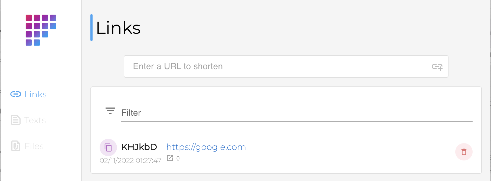
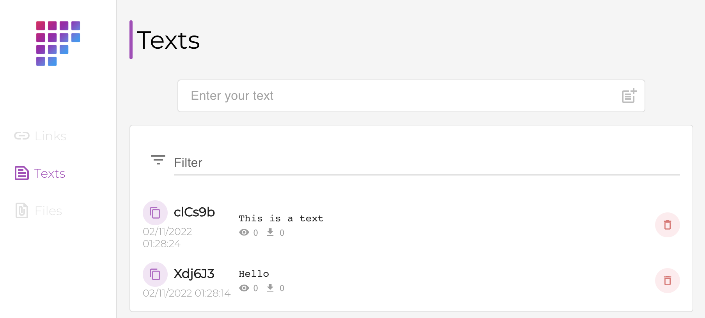
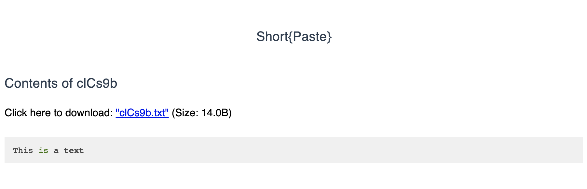
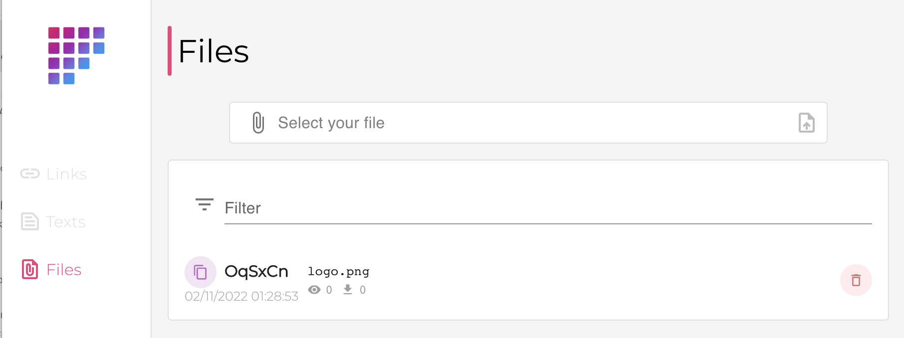
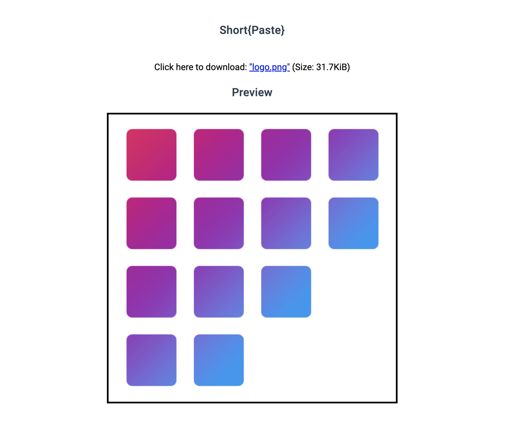

# Short{Paste}

[![gh_last_release_svg]][gh_last_release_url]
[![tippin_svg]][tippin_url]

[gh_last_release_svg]: https://img.shields.io/github/v/release/bemble/shortpaste?sort=semver
[gh_last_release_url]: https://github.com/bemble/shortpaste/releases/latest

[tippin_svg]: https://img.shields.io/badge/donate-BuyMeACoffee-ffdd00?logo=buymeacoffee&style=flat
[tippin_url]: https://www.buymeacoffee.com/bemble

> A lightweight personnal URL shortener, pastebin and file uploader.

Short{Paste} is open-source software written in Go and React. It is a minimalistic shortener that combines three things that need shortening: links, files, and text. It is a self-hosted alternative to many popular services like bitly, paste bin and using dropbox to send a file to someone quickly.

The Go backend handles saving files, links, and text in DB and filesystem as needed, while the React UI provides a pretty view for you to add and review content. Added bonus, it tracks hit counts too!

## Running

### Docker

```bash
docker run -v "${pwd}/shortpaste/data:/app/data" -p8080:8080 --env-file "${pwd}/shortpaste/.env" ghcr.io/bemble/shortpaste:latest 
```

### Docker compose

```yml
  shortpaste:
    image: ghcr.io/bemble/shortpaste:latest 
    container_name: shortpaste
    restart: unless-stopped
    ports:
      - ${PORT_SHORTPASTE}:8080
    env_file:
      - "${PWD}/shortpaste/.env"
    volumes:
      - "${PWD}/shortpaste/data:/app/data"
      - /usr/share/zoneinfo:/usr/share/zoneinfo:ro
      - /etc/localtime:/etc/localtime:ro
```


### Build docker image

```bash
rm -rf public
docker build . -t shortpaste
```

## Environment Variables

You can customize the behavior using environment variables:.

| Environment Variable | Default Value    | Behaviour                                                                                                                     |
| -------------------- | ---------------- | ----------------------------------------------------------------------------------------------------------------------------- |
| `API_KEY`            | `CHANGE-IT-ASAP` | API key used to communicate with the API.                                                                                     |
| `BASE_PATH`          | `/`              | App base path (use it if the app does not have run its dedicated domain name).                                                |
| `DOMAIN`             |                  | Override shortened URL domain in front, when copy to clipboard (default is the actual page domain). Example: `https://sho.rt` |
| `DEBUG`              |                  | Whether the app runs in debug mode or not (basically just more logs).                                                         |
| `PORT`               | 8080             | Port on which app is running, **should not be changed**.                                                                      |

## Securing

Keep in mind that Short{Paste} is not secured by any authentication, API key is not enough if Short{Paste} is exposed on the internet.

Short{Paste} should run behind a reverse proxy (such as as `nginx-proxy-manager` or `trafeik`).
Configure your reverse proxy to directly expose only `/l/*`, `/t/*` and `/f/*`. All other routes (most important `/api`) should wether not be exposed on the internet or with an authentication layer.

## Screenshots

Here are some screenshots to get a taste of it:

| Type  |                      Create                      |                          View                         |
| :---: | :----------------------------------------------: | :---------------------------------------------------: |
| Links |  |                                                       |
| Text  |  |  |
| Files |  |  |


## Development

### Requirements

* Golang version 1.19 minimum must be installed

### Folder structure

* Create a `data` folder at project root
* Add a configuration file
* :warning: while developing, you should not use a `base_path`

### Running the server

#### For server development

Server will run on port `8080`:

```bash
cd server
go run main.go
```

Alternatively, you can use `nodemon` to get server restart on file change:

```bash
npm i -g nodemon
nodemon --exec go run main.go --signal SIGTERM
```

#### For front-end development

You might want to run the server just to develop on the front.
You can use previous method or use `Docker` to run it (and do not install all go environment etc).

```
docker build . -f server/Dockerfile.dev -t shortpaste/dev-server
docker run -t -i --rm -p8080:8080 -v"$(pwd)/data:/app/data" -v"$(pwd)/server:/app/server" shortpaste/dev-server
```

You should rebuild on update.

### Running the front-end

Front-end is developed in React. You need to have the server running.

To run the front:

```bash
cd front
npm i
npm run start
```

Your web browser should open on `http://localhost:3000`. The app is configured to proxy the server for development purpose (ie. api is also reachable on `http://localhost:3000/api`).

**Note:** if you set an API key in your configuration, you must set it when running front: `REACT_APP_API_KEY=<yourkey> npm run start`

## TODO

- [x] optimize build time
- [x] allow user to set the public url for shortened content
- [x] move from sqlite3 to modernc.org/sqlite to compile without CGO (and use scratch, lighter image)
- [ ] display status with version
- [ ] allow user to change language
- [ ] add all options in front when create a new text
- [ ] error handling (on add and delete)
- [ ] allow edit?
- [ ] display text and file in frontend

## Credits

Short{Paste} is based on [Adyanth Hosavalike's Short{Paste}](https://github.com/adyanth/shortpaste) but have been nearly completely rewrittent.